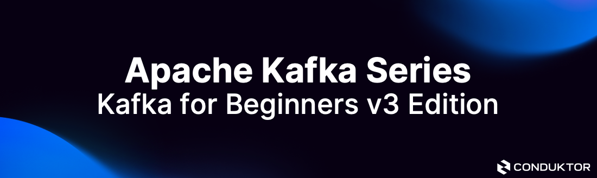

## Tech Stack
 

    
    
 

## Content
- Basics of Kafka Java Programming
- Wikimedia Producer
- OpenSearch Consumer
- Kafka Streams Sample Application

## Learn with me
### Some notes while going over the course: 
  - Producers sends data to Kafka Topic
  - Consumers reads data from Kafka Topic
- Topic can have partitions and each partition has messages with an offset (an id)

## Producers
- Producers can send messages with a key or not.
- Kafka serializes the key and also the value into bytes.
- Different types of serializers for Kafka Messages: JSON, Int, Float, Avro, Protobuf
- Kafka Message Key Hashing
- Key hashing is the process of determining the mapping of a key to a partition
- Uses murmur2 algorithm 
    -targetPartition = Math.abs(Utils.murmur2(keyByes)) % (numPartitions -1)

## Consumers

- Consumers read data from a topic (identified by name) -pull model 
- Data is read in order from low to high offset with each partitions. 
- Consumer has to know the format of the message 
- Consumer Offset, offsets commited are in Kafka topic named __consumer_offsets
- 3 Delivery semantics
At least once,
At most once,
Exactly once,

## Kafka Brokers

-a kafka cluster is composted of multiple brokers(servers) called a Kafka broker
-only need to connect to one broker and the kafka clients will know how to be connected to the entire cluster
- Leader for a partition; only one broker can be a leader for a given parittion

## Producer acknolwedgements (acks)
- Producers can chose to receive acknowledgement of data writes

## ZooKeeper

[Conduktor](https://www.conduktor.io) is about making Kafka accessible to everyone. Check out our free Kafka learning website [Kafkademy](https://kafkademy.com/) and our Apache Kafka Desktop Client [Conduktor DevTools](https://conduktor.io/download)

